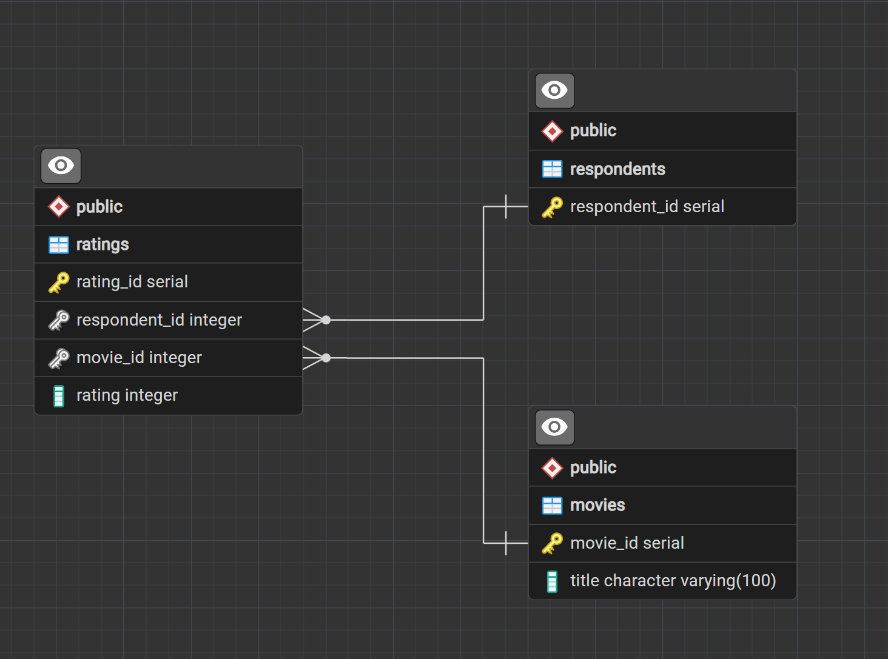

```{r setup, include=FALSE}
knitr::opts_chunk$set(echo = TRUE)

#| echo: true
#| message: false
#| warning: false
```

```{r assignment-details}
#| echo: false
#| message: false
#| warning: false
  
  
### Assignment Details

#Assignment: SQL and R – Movie Ratings
#Objective
#Collect simple movie-rating data, store it in a SQL database, and analyze it in R.

#Implementation Notes:
#PostgreSQL is the recommended (and supported) relational database for this assignment.  If you are unable to install and configure PostgreSQL in your environment, you may find SQLite easier to use.  Students experienced with relational databases may use any local or cloud-based database for their assignment.
#NEVER include passwords in your code.  For this assignment, the ability to reproduce your work in my environment is not required, but you need to provide all of the necessary code, include the code used to create and populate tables.
#Task Description

#Select six recent popular movies (or television episodes or books or songs or ...)

#Ask at least five people to rate each movie they have seen on a 1–5 scale.

#Store the collected ratings in a SQL database of your choice.

#Load the data from SQL into R as a dataframe.

##Implementation Notes

#The assignment is intentionally open-ended; multiple approaches are acceptable.

#You may:

#Query the SQL database directly from R, or

#Export SQL data to a .csv file and load it into R.

#If you use a GUI to create or populate tables, you must also provide the SQL code needed to recreate them.

##Reproducibility

#Your solution should be reproducible assuming the same SQL server and R environment.

#You may remove or mask database passwords.

#Full reproducibility of survey responses is not required.

##Missing Data

#You must demonstrate a reasonable strategy for handling missing ratings, since not all participants will have seen all movies.

#Optional Enhancements
#You may improve your solution by:

#Using survey software to collect ratings

#Managing database credentials securely

#Designing a normalized database schema

#Exploring whether standardizing ratings is beneficial

#Submission Requirements

#Post all code (SQL, R, Quarto) in a GitHub repository

#Submit the GitHub link

#RPubs publication is not required

#Group work is allowed, but each student must submit individually and list collaborators

#Professional Expectation
#Treat this as portfolio-quality work suitable for a job interview.
```

## Introduction and Overview

This assignment involves data collection via a Movie Survey. The survey was distributed to a group of potential participants, with the goal of capturing movie preferences from at least five people. The scope of this specific Movie Survey was limited to films with the Director role as Paul Thomas Anderson. Nine of Anderson's films were listed with a rating system of 1 (Strongly Dislike) to 5 (Strongly Like). The release year of each movie was included, and that data was sourced from the website 'imdb.com'. Potential participants received the Movie Survey via email or URL link.

Once data collection has completed, the next step is to input the survey results into a SQL database. After inputting the data, analysis will be performed in R, utilizing SQL queries to retrieve the data from the local database.

Anticipated challenges in this assignment include the initial data collection phase and managing missing ratings in the survey. One strategy to increase the survey's reach is to post the survey link in the DATA 607 slack channel or to share the URL with classmates during a meetup. Strategies to manage missing data include calculating the proportion of each rating for responses for each film. In other words, rather than relying on raw counts of 'Strongly Dislike' and other ratings, the percent of responses displaying 'Strongly Dislike' will be calculated, and the same process will be executed for other ratings. Another strategy could be to make "no response" its own category, and display that with the data in histograms. This would help to visualize the relative magnitude of 'no response' vs. 'rated response'.

Possible enhancements to this assignment include secure database credential management, assessing the benefits of normalizing the database schema, and determining the advantage of standardizing ratings. Once findings of this study are determined and verified, recommendations for future improvements and analysis will be outlined.

## Synthetic Data Generation

Due to a paucity of survey respondents, ratings data was synthesized. To create a mock data set, SQL code was written to initialize a PostgreSQL database. The code is replicated in the below code chunk. The code will not execute, but is here for demonstration purposes.

```         
-- DATA 607 - Assignment 2A - SQL Database Input

-- ---------------------------------------------------------
-- Section 1. Schema
-- ---------------------------------------------------------
-- first, clear out existing tables before entering mock data
DROP TABLE IF EXISTS ratings;
DROP TABLE IF EXISTS movies;
DROP TABLE IF EXISTS respondents;

-- create respondent table with respondent_id as primary key
CREATE TABLE respondents (
    respondent_id SERIAL PRIMARY KEY
);
-- create movies table with primary key of movie_id
CREATE TABLE movies (
    movie_id SERIAL PRIMARY KEY,
    title VARCHAR(100) NOT NULL
);

-- No rating row = that respondent hasn't seen/rated that movie.
-- create ratings table with rating_id as primary key
CREATE TABLE ratings (
    rating_id SERIAL PRIMARY KEY,
    respondent_id INT NOT NULL REFERENCES respondents(respondent_id),
    movie_id INT NOT NULL REFERENCES movies(movie_id),
    rating INT CHECK (rating BETWEEN 1 AND 5), -- only accept an integer between 1 and 5
    UNIQUE (respondent_id, movie_id)
);

-- ---------------------------------------------------------
-- Section 2. Mock respondents
-- ---------------------------------------------------------
-- insert 7 users into respondent table
INSERT INTO respondents (respondent_id)
VALUES (DEFAULT), (DEFAULT), (DEFAULT), (DEFAULT), (DEFAULT), (DEFAULT), (DEFAULT);


-- ---------------------------------------------------------
-- Section 3. Movie Titles Insertion 
-- ---------------------------------------------------------
-- insert 9 movies into movie table
INSERT INTO movies (title) VALUES
('One Battle After Another (2025)'),
('Licorice Pizza (2021)'),
('Phantom Thread (2017)'),
('Inherent Vice (2014)'),
('The Master (2012)'),
('There Will Be Blood (2007)'),
('Punch-Drunk Love (2002)'),
('Magnolia (1999)'),
('Boogie Nights (1997)');
-- data sourced from 'imdb.com'


-- ---------------------------------------------------------
-- Section 4. Mock ratings, deliberately incomplete
--    (not every respondent rated every movie)
-- ---------------------------------------------------------
-- insert mock respondent data (7 users and 9 movies)
INSERT INTO ratings (respondent_id, movie_id, rating) VALUES
-- respondent 1, movie 1, rating 5, etc.
(1, 1, 5), (1, 2, 4), (1, 3, 3), (1, 4, 5), (1, 5, 4), (1, 6, 3),(1, 7, 5), (1, 8, 4), (1, 9, 3),
-- respondent 2
(2, 1, 4), (2, 2, 5), (2, 3, 2), (2, 4, 3), (2, 5, 1), (2, 7, 5), (2, 8, 2), (2, 9, 4),
-- respondent 3
(3, 1, 3), (3, 3, 5), (3, 5, 4), (3, 7, 3), (3, 9, 5),
-- respondent 4
(4, 2, 4), (4, 4, 3), (4, 6, 5), (4, 8, 4),
-- respondent 5
(5, 1, 5), (5, 5, 2), (5, 3, 5), (5, 7, 5), (5, 9, 2),
-- respondent 6
(6, 3, 4), (6, 2, 4), (6, 4, 4), (6, 5, 4),
-- respondent 7
(7, 2, 3), (7, 4, 4), (7, 6, 3);
```

Additional queries were written to practice pulling and summarizing data before import into R. Portions of this code were replicated below when actually pulling data from the database into R. Lastly, this code chunk will not execute.

```         
-- DATA 607 - Assignment 2A - SQL Database Querying

-- ---------------------------------------------------------
-- 1. Select all data from ratings
-- ---------------------------------------------------------
select * from ratings;

-- ---------------------------------------------------------
-- 2. Output summary table listing how many movies each respondent rated
-- ---------------------------------------------------------
select respondent_id, count(*) as movies_rated
	from ratings
	group by respondent_id
	order by respondent_id;
```

## Data Import into R

Importing data from the local database into R will be guided by this support article from Posit: (<https://support.posit.co/hc/en-us/articles/214510788-Setting-up-R-to-connect-to-SQL-Server>). Additionally, the help files for RPostgres and the website for RPostgres (<https://rpostgres.r-dbi.org/>) will provide important guidance for data import. Originally, the database password verification was achieved via a method in the posit support document above, in which the user is prompted for a password via the dialog box. However, this created issues when rendering the Quarto document to html, and therefore a new approach was needed. The old code has been commented out, and it remains as an artifact. Instead, a method using .Renviron replaces the original method as a preferred method, according to posit documentation (<https://solutions.posit.co/connections/db/best-practices/managing-credentials/#use-environment-variables>).

```{r connect-to-DB}
#| echo: true
#| message: false
#| warning: false

#library(DBI)
library(RPostgres)
#library(odbc)

#establish connection
con <- dbConnect(RPostgres::Postgres(),
                 dbname = 'Second_DB_DATA607', 
                 host = 'localhost',
                 port = 5432,
                 user = Sys.getenv("DATA_607_DB_USER"),
                 password = Sys.getenv("DATA_607_DB_PW"))
                 # password = rstudioapi::askForPassword("DB pw"))  
                 ### old password verification method
                 

#?RPostgres
```

Now that the database connection has been established, the import can begin. A mapping of the PostgreSQL database schema is attached as reference, which was generated in pgAdmin 4.



The three tables in the database will be imported to data frames using simple SQL commands. This SQL code was replicated from above in the trial queries section.

```{r DB-import}
#| echo: TRUE
#| warning: FALSE
#| message: FALSE


library(tidyverse)

df_movies <- dbGetQuery(con, "select * from movies;")

df_respondents <- dbGetQuery(con, "select * from respondents;")

df_ratings <- dbGetQuery(con, "select * from ratings;")

##closing the DB conneciton after importing data
dbDisconnect(con)
## Confirming df_Ratings is of expected dimensions 
glimpse(df_ratings)


```

## Data Tidying

First, the dplyr package will be utilized to join existing data frames. The 'ratings' and 'movies' frames can be joined via the 'movie_id' key. Then the subsequent frame can be joined to 'respondents' via the 'respondent_id' key. The second join does not materially alter the initial frame, as 'respondent_id' is the only attribute in the 'respondents' frame. However, this step can be useful in verification: only allowing ratings with valid 'respondent_id' values pass through the join.

```{r join-tables}

df <- left_join(df_ratings, 
                df_movies, 
                by = "movie_id")
    
df <- left_join(df, 
                df_respondents, 
                by = "respondent_id")

head(df)

#?left_join
```

## Handling Missing Data

Missing data in this movie survey can be input as NA values, and subsequent functions will omit those data from the calculations. First, a data structure containing all possible combinations of 'respondent_id' and 'movie_id' is generated using DPLYR's 'expand.grid'. This new frame will act as the scaffolding into which other data is input. Any 'respondent_id' - 'movie_id' combination that does not have matching rating data will be left as NA.

```{r missing-data}

respondent_movie_combinations <- expand.grid(
  respondent_id = df_respondents$respondent_id,
  movie_id = df_movies$movie_id
)  

df_2 <- respondent_movie_combinations |>
  left_join(df_ratings, 
            by = c("respondent_id",
                   "movie_id")) |>
  left_join(df_movies, 
            by="movie_id")

#NA values visible in rating id and rating column
head(df_2)
```

Next, the magnitude of missing data is quickly calculated and displayed as output along with the number of existing records with complete ratings.

```{r missing-data-count}

num_missing <- sum(is.na(df_2$rating_id))

num_entries <- sum(!is.na(df_2$rating_id))

msg <- paste("There are ", num_missing, " missing ratings in this data frame and", num_entries, " completed ratings in this data frame.")
           
msg
```

## Visualization and Analysis

The facet_wrap function in ggplot is utilized to generate plots of each movie's ratings as a bar chart in an organized fashion.

```{r plot-bar-charts}
#| echo: true
#| message: false
#| warning: false

ggplot(df_2, aes(x=rating))+
  geom_bar() +
  facet_wrap(~ title) +
  labs(x="Rating (1 = Strongly Dislike, 5 = Strongly Like)",
       y="Number of Respondents",
       title = "Rating Spread of Movies Directed by Paul Thomas Anderson Since 1997") +
  theme_minimal()
```

The mean rating for each movie is calculated without the missing data. Standard deviations are also calculated for each movie.

```{r brute-force}
#| echo: false
#| message: false
#| warning: false


df_2 |>
  summarize(mean_1 = mean(
            subset(df_2$rating,
           df_2$rating>0 & 
             df_2$movie_id==1), 
            na.rm = TRUE),
           # 
           mean_2 = mean(
              subset(df_2$rating,
                     df_2$rating>0 & 
                       df_2$movie_id==2), 
              na.rm = TRUE),
           #
           mean_3 = mean(
             subset(df_2$rating,
                    df_2$rating>0 & 
                      df_2$movie_id==3), 
             na.rm = TRUE),
           #
           mean_4 = mean(
             subset(df_2$rating,
                    df_2$rating>0 & 
                      df_2$movie_id==4), 
             na.rm = TRUE),
           #
           mean_5 = mean(
             subset(df_2$rating,
                    df_2$rating>0 & 
                      df_2$movie_id==5), 
             na.rm = TRUE),
           #
           mean_6 = mean(
             subset(df_2$rating,
                    df_2$rating>0 & 
                      df_2$movie_id==6), 
             na.rm = TRUE),
           #
           mean_7 = mean(
             subset(df_2$rating,
                    df_2$rating>0 & 
                      df_2$movie_id==7), 
             na.rm = TRUE),
           #
           mean_8 = mean(
             subset(df_2$rating,
                    df_2$rating>0 & 
                      df_2$movie_id==8), 
             na.rm = TRUE),
           #
           mean_9 = mean(
             subset(df_2$rating,
                    df_2$rating>0 & 
                      df_2$movie_id==9), 
             na.rm = TRUE))
            
# There must be an easier way to calculate these mean values
```

Chapter 4 of 'R for Data Science' (<https://r4ds.hadley.nz/workflow-style.html#sec-pipes>) contains example code that uses a piping of filter then group_by then summarize to deliver mean arrival times in the 'nycflights' data. A similar approach was replicated below to compute a summary more elegantly.

```{r elegant-summary}

df_2 |>
  filter(rating > 0) |> #remove null values
  
  group_by(movie_id) |> #create grouping for the summarize to act on
  
  summarize (mean_rating = mean(rating, na.rm=TRUE), #calc mean BY movie_id
             SD_rating = stats::sd(rating, na.rm=TRUE))|> #calc SD by movie_id
  
  arrange(desc(mean_rating)) #sort so highest rated at top

```

The distribution of ratings data is plotted in a ridge plot. Certain difficulties were encountered in the process of generating the figure. First, the legend needed to be removed, as it created visual noise without assisting in distinguishing the plotted series. Removal of the legend was accomplished by setting the 'show.legend' boolean to false. Inspiration for this technique was found here: <https://ggplot2-book.org/maps.html#sec-polygonmaps>. Plotting the data as a ridgeline was inspired from a previous project and this resource: <https://wilkelab.org/ggridges/articles/introduction.html>.

```{r ridge-plot}

library(ggridges)

df_2 |>
  filter(rating>0) |> #remove nulls
  ggplot(aes(x=rating, 
             y=title, 
             fill=title)) +
  geom_density_ridges(scale = 1, 
                      alpha=0.7, show.legend = FALSE) +
  labs(title="Distribution of Ratings for Movies Directed by\nPaul Thomas Anderson (ranked by mean rating)",
       x = "Rating",
       y = "Title") +
  ylab(NULL)

?geom_density_ridges
```
